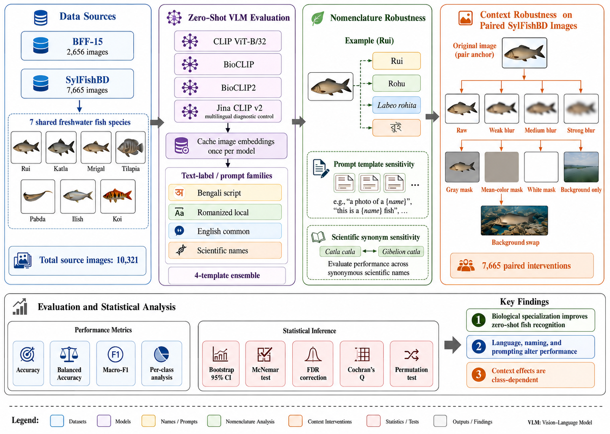
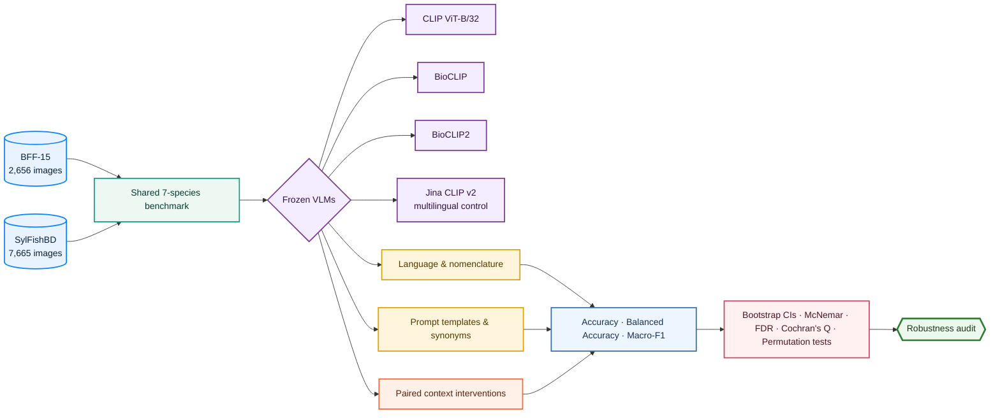

<div align="center">

# 🐟 IchthyoNoma

### Nomenclature and Context Sensitivity in Zero-Shot Vision–Language Models for Bangladeshi Freshwater Fish Recognition

**Anonymous submission to the 2nd Workshop on Grounded and Faithful Vision-Language Models for Real-World Deployment (VLM4RWD), NeurIPS 2026**

**December 2026 · Sydney, Australia**

<p>
  
  
  
  
  
  
</p>

</div>

---

<p align="center">
  
</p>

## 🔎 Overview

Zero-shot vision–language models (VLMs) are increasingly used as **training-free species recognizers**, but a reported zero-shot score can reflect more than visual knowledge of the organism itself.

**IchthyoNoma** audits how freshwater-fish recognition changes when the **model**, **language**, **nomenclature**, **prompt formulation**, and **visual context** are varied while all model weights remain frozen.

The study evaluates **CLIP ViT-B/32**, **BioCLIP**, **BioCLIP2**, and **Jina CLIP v2** across **10,321 images** from two public Bangladeshi freshwater-fish sources, **BFF-15** and **SylFishBD**, using seven shared species categories.

> ### Core question
> **How stable is zero-shot biological recognition when the textual interface or visual context changes?**

This is an **evaluation audit**, not a model-training benchmark. The goal is not only to identify the strongest checkpoint, but to determine which parts of zero-shot performance arise from **biological specialization**, **multilingual alignment**, **naming choices**, **prompt construction**, and **contextual cues**.

---

## 🧭 Research map

The repository is organized around five linked evaluation axes.



---

## 🌍 Why this matters

A high zero-shot score does not necessarily imply robust species understanding. Performance may depend on:

- **how the species is named** — Romanized local name, Bengali script, English-common name, or scientific binomial;
- **which prompt template** is used to create the class prototype;
- **which taxonomic synonym** is supplied;
- **whether multilingual alignment is strong enough** for a local-language interface;
- **whether visual context or background information** contributes to the prediction.

For biodiversity monitoring, fisheries, aquaculture, market inspection, and automated biological decision-support systems, these factors determine whether a model that appears strong under one benchmark configuration remains useful under real deployment conditions.

---

## 📊 Benchmark at a glance

| Component | Configuration |
|---|---|
| 🖼️ **Source images** | **10,321** |
| 🗂️ **Datasets** | **BFF-15:** 2,656 · **SylFishBD:** 7,665 |
| 🐠 **Shared species** | Rui, Katla, Mrigal, Tilapia, Pabda, Ilish, Koi |
| 🧠 **Primary VLMs** | CLIP ViT-B/32 · BioCLIP · BioCLIP2 |
| 🌐 **Multilingual control** | Jina CLIP v2 |
| 📝 **Text-side variables** | Romanized · Bengali script · English-common · scientific |
| 🧬 **Nomenclature analysis** | Prompt templates · scientific-name variants · synonyms |
| 🖼️ **Context interventions** | Blur · gray/mean/white masks · crop · background-only · background swaps |
| 📐 **Metrics** | Accuracy · balanced accuracy · macro-F1 · per-class effects |
| 📏 **Statistics** | Stratified bootstrap CIs · McNemar · BH-FDR · Cochran's Q · permutation tests |

> Each selected SylFishBD image is paired with a binary segmentation mask used for the context interventions.

---

## ✨ Selected findings

| Finding | Evidence | Interpretation |
|---|---|---|
| 🟣 **Biological specialization dominates** | BioCLIP2 reaches **72.36%** on BFF-15 and **68.91%** on SylFishBD under its strongest reported label families | Biology-specialized pre-training provides a large advantage over generic CLIP |
| 🔵 **Nomenclature changes the classifier** | BioCLIP2 changes from **35.77% → 72.36% → 69.99%** on BFF-15 across Romanized → English-common → scientific labels | The text label is not a neutral wrapper around the image encoder |
| 🟡 **Bengali exposes an interface gap** | BioCLIP2 Bengali balanced accuracy is **14.22–14.29%**, close to seven-class chance | Strong biological recognition does not guarantee strong local-language alignment |
| 🟠 **Multilingual alignment ≠ biological specialization** | Jina partially recovers Bengali discrimination to **21.89% / 16.36%**, but remains much weaker than BioCLIP2 in fine-grained recognition | The two capabilities solve different failure modes |
| 🟢 **Context effects are class-dependent** | Strong blur changes overall SylFishBD accuracy by **−2.87 pp**, yet Rui falls **−18.38 pp** while Katla/Mrigal improve | Aggregate robustness can hide species-specific behavior |
| 🔴 **Synthetic masking can overstate context effects** | White mask causes **−8.39 pp**, much larger than gray/mean-color masking (~**−3.8 pp**) | Intervention design itself can introduce distribution shift |

---

## 📈 Visual results

### Prompt-family response across models and datasets

<p align="center">
  
</p>

**Reading the figure:** model identity is encoded by color; BFF-15 and SylFishBD are separated by line style. The figure should be interpreted as a **categorical response profile**, not as a continuous trend.

### Shared-species image distribution

<p align="center">
  
</p>

The connected-dot representation highlights the different per-class image counts across the two sources while preserving the same seven-species benchmark.

### Species-level context response

<p align="center">
  
</p>

The context analysis shows that aggregate changes can conceal strong class-level heterogeneity.

---

## 🧪 Experimental design

### 1. Cross-model zero-shot benchmark

Frozen **CLIP ViT-B/32**, **BioCLIP**, and **BioCLIP2** are evaluated on the same seven shared fish categories.

### 2. Nomenclature and prompt audit

The image embeddings remain fixed while the text-side classifier is varied through:

- Romanized vernacular names;
- Bengali-script names;
- English-common names;
- scientific names;
- four prompt templates;
- selected scientific-name variants and synonyms.

### 3. Multilingual diagnostic control

**Jina CLIP v2** is included to test whether BioCLIP2's weak Bengali results reflect a multilingual text-alignment limitation rather than a general failure of Bengali nomenclature.

Jina is treated as an **interface diagnostic**, not as a biological baseline.

### 4. Paired context interventions

SylFishBD masks support paired image-level interventions:

- weak, medium, and strong Gaussian blur;
- gray, mean-color, and white masks;
- tight crop;
- background-only views;
- cross-species background swaps.

These are interpreted as **stress tests**, not perfect causal interventions, because transformations can alter the image distribution as well as the information content.

### 5. Statistical inference

The analysis uses:

- class-stratified bootstrap confidence intervals;
- exact two-sided McNemar tests;
- Benjamini–Hochberg false-discovery-rate correction;
- Cochran's Q;
- permutation testing for donor-follow behavior.

---

## 🐟 Shared seven-species benchmark

| Class | Romanized | English common | Scientific | BFF-15 | SylFishBD |
|---|---|---|---|---:|---:|
| Rui | Rui | Rohu | *Labeo rohita* | 514 | 1,670 |
| Katla | Katla | Catla | *Catla catla* | 427 | 1,133 |
| Mrigal | Mrigal | Mrigal carp | *Cirrhinus cirrhosus* | 317 | 1,293 |
| Tilapia | Tilapia | Nile tilapia | *Oreochromis niloticus* | 383 | 1,326 |
| Pabda | Pabda | Pabda catfish | *Ompok pabda* | 348 | 862 |
| Ilish | Ilish | Hilsa | *Tenualosa ilisha* | 233 | 789 |
| Koi | Koi | Climbing perch | *Anabas testudineus* | 434 | 592 |
| **Total** |  |  |  | **2,656** | **7,665** |

---

## 🏆 Primary zero-shot benchmark

Values are **accuracy / macro-F1 (%)**.

| Model | Prompt | BFF-15 | SylFishBD |
|---|---|---:|---:|
| CLIP ViT-B/32 | Romanized | 10.96 / 5.64 | 16.95 / 13.15 |
|  | English common | 25.15 / 20.03 | 23.80 / 22.05 |
|  | Scientific | 15.40 / 6.97 | 14.40 / 7.21 |
| BioCLIP | Romanized | 25.26 / 18.28 | 27.93 / 16.63 |
|  | English common | 54.89 / 51.61 | 52.26 / 46.64 |
|  | Scientific | 47.82 / 43.34 | 58.88 / 57.45 |
| BioCLIP2 | Romanized | 35.77 / 25.98 | 37.56 / 25.19 |
|  | English common | **72.36 / 67.33** | 64.59 / 64.30 |
|  | Scientific | 69.99 / 68.85 | **68.91 / 69.68** |

---

## 🌐 Jina CLIP v2 multilingual control

Values are **accuracy / balanced accuracy / macro-F1 (%)**.

| Prompt family | BFF-15 | SylFishBD |
|---|---:|---:|
| Bengali script | 25.30 / 21.89 / 16.31 | 10.08 / 16.36 / 6.04 |
| Romanized | 24.89 / 23.93 / 19.05 | 14.74 / 14.78 / 12.06 |
| English common | 29.41 / 28.43 / 17.87 | 23.78 / 18.01 / 15.62 |
| Scientific | 16.11 / 15.96 / 13.56 | 9.13 / 10.27 / 9.75 |

---

## 🧩 Repository structure

```text
IchthyoNoma/
├── README.md
├── requirements.txt
├── requirements-kaggle.txt
├── .gitignore
├── CITATION.cff.template
│
├── assets/
│   ├── study_overview.png
│   ├── prompt_family_accuracy.png
│   ├── species_distribution_dotmap.png
│   └── context_effects.png
│
├── data/
│   └── README.md
│
├── docs/
│   ├── REPRODUCIBILITY.md
│   ├── NOTEBOOK_PROVENANCE.md
│   └── RELEASE_CHECKLIST.md
│
├── notebooks/
│   ├── README.md
│   ├── 01_primary_zero_shot_benchmark.ipynb
│   ├── 02_context_robustness_controls.ipynb
│   └── 03_multilingual_jina_control.ipynb
│
├── results/
│   ├── README.md
│   ├── primary_zero_shot_benchmark.csv
│   ├── context_ladder.csv
│   ├── jina_multilingual_metrics.csv
│   └── jina_pairwise_language_tests.csv
│
├── scripts/
│   ├── validate_dataset_counts.py
│   └── verify_release_results.py
│
└── paper/
    └── anonymous_submission.pdf
```

---

## ♻️ Reproducibility status

This repository preserves the paper-level result tables, the documented evaluation protocol, and executable analysis notebooks.

### Notebook provenance

- `03_multilingual_jina_control.ipynb` is retained from the original working experiment.
- `01_primary_zero_shot_benchmark.ipynb` and `02_context_robustness_controls.ipynb` are **reference implementations reconstructed from the documented paper protocol**.

The two reconstructed notebooks reproduce the documented methodology but **must not be represented as the exact historical execution files**.

See [`docs/NOTEBOOK_PROVENANCE.md`](docs/NOTEBOOK_PROVENANCE.md) for the provenance record.

For a definitive archival release, replace the reconstructed notebooks with the original executed notebooks if they are available and can be safely stripped of credentials, private paths, and machine-specific state.

---

## 💾 Data

The datasets are **not redistributed** in this repository.

Expected class structure, image counts, and local setup instructions are documented in:

[`data/README.md`](data/README.md)

Please obtain BFF-15 and SylFishBD from their respective original sources and comply with their individual licenses and usage terms.

---

## ⚙️ Environment setup

### General local environment

```bash
python -m venv .venv

# Linux / macOS
source .venv/bin/activate

# Windows
.venv\Scripts\activate

pip install -r requirements.txt
```

### Jina multilingual experiment on Kaggle

```bash
pip install -r requirements-kaggle.txt
```

The Kaggle dependency file intentionally avoids unnecessary replacement of Kaggle's preinstalled NumPy, Pandas, and SciPy stack.

---

## ✅ Verification

Validate released result tables:

```bash
python scripts/verify_release_results.py
```

Validate a local dataset layout and image counts:

```bash
python scripts/validate_dataset_counts.py /path/to/dataset --target BFF-15
python scripts/validate_dataset_counts.py /path/to/dataset --target SylFishBD
```

---

## 📄 Paper

The anonymized submission is expected at:

[`paper/anonymous_submission.pdf`](paper/anonymous_submission.pdf)

| | |
|---|---|
| **Workshop** | 2nd Workshop on Grounded and Faithful Vision-Language Models for Real-World Deployment (**VLM4RWD**) |
| **Venue** | **NeurIPS 2026** |
| **Location** | Sydney, Australia |
| **Date** | December 2026 |
| **Review state** | Anonymous submission |

The paper evaluates frozen VLMs across language, nomenclature, prompt, and context changes and reports confidence intervals and paired significance tests for the primary robustness analyses.

---

## 🕵️ Anonymous-review notice

This repository corresponds to an anonymous workshop submission.

During double-blind review:

- do not publish it from a personally identifying account unless explicitly permitted by the venue;
- remove author names, institutional identifiers, personal URLs, acknowledgements, and identifying metadata;
- use an anonymized supplementary archive or anonymized repository if reviewer code access is required;
- verify the workshop's current anonymity and supplementary-material policy before public release.

A private repository is the safest default until the anonymity period ends.

---

## 📚 Citation

A release template is provided in [`CITATION.cff.template`](CITATION.cff.template).

Populate the final authors, repository URL, release date, DOI/arXiv identifier, and archival metadata only after they can be publicly disclosed.

```bibtex
@inproceedings{ichthyonoma2026,
  title     = {IchthyoNoma: Nomenclature and Context Sensitivity in Zero-Shot Vision--Language Models for Bangladeshi Freshwater Fish Recognition},
  author    = {Author list after de-anonymization},
  booktitle = {2nd Workshop on Grounded and Faithful Vision-Language Models for Real-World Deployment (VLM4RWD), NeurIPS},
  year      = {2026}
}
```

---

## ⚖️ License

No software license is asserted by this README.

Before public release:

1. select a code license approved by all authors;
2. confirm redistribution rights for third-party assets and code;
3. preserve the original licenses and terms of the underlying datasets.

Dataset licenses remain independent of any code license eventually applied to this repository.

---

## ⚠️ Responsible interpretation

The benchmark should **not** be interpreted as evidence that any evaluated model has general biological understanding or general Bengali-language understanding.

The results are specific to:

- seven fish categories;
- two public Bangladeshi data sources;
- the evaluated checkpoints;
- the tested label strings and prompt templates;
- one multilingual control;
- the implemented context interventions.

The broader recommendation is methodological:

> **Zero-shot biological benchmarks should explicitly report and stress-test language, exact nomenclature, prompt formulation, and visual context rather than presenting a single prompt configuration as the model's intrinsic accuracy.**

---

<div align="center">

### 🐟 IchthyoNoma
**Auditing what zero-shot biological recognition scores actually measure.**

</div>
